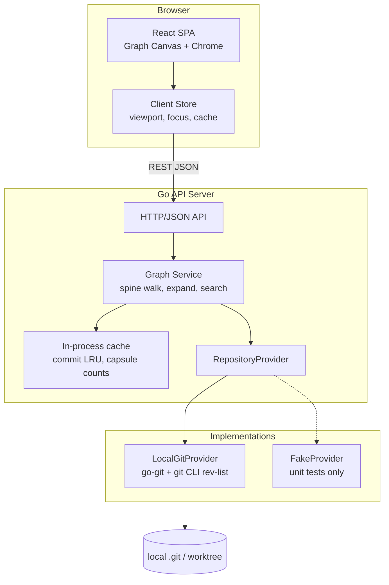
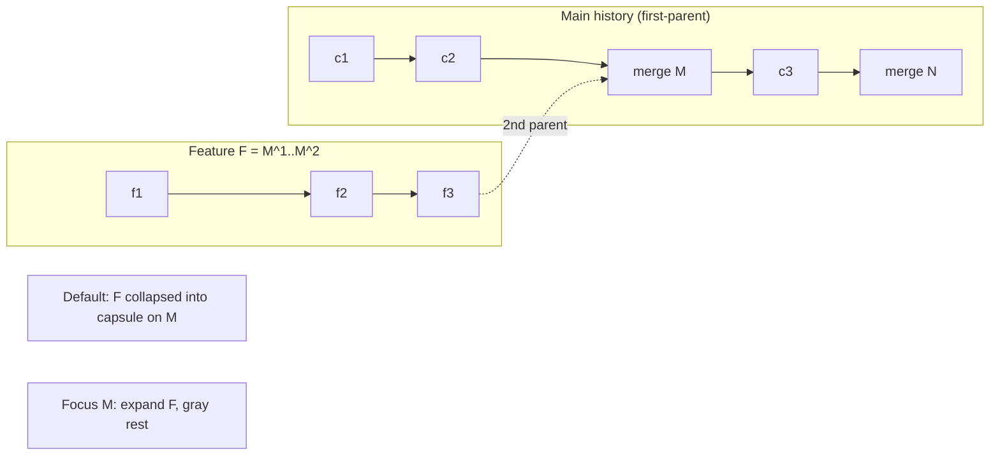
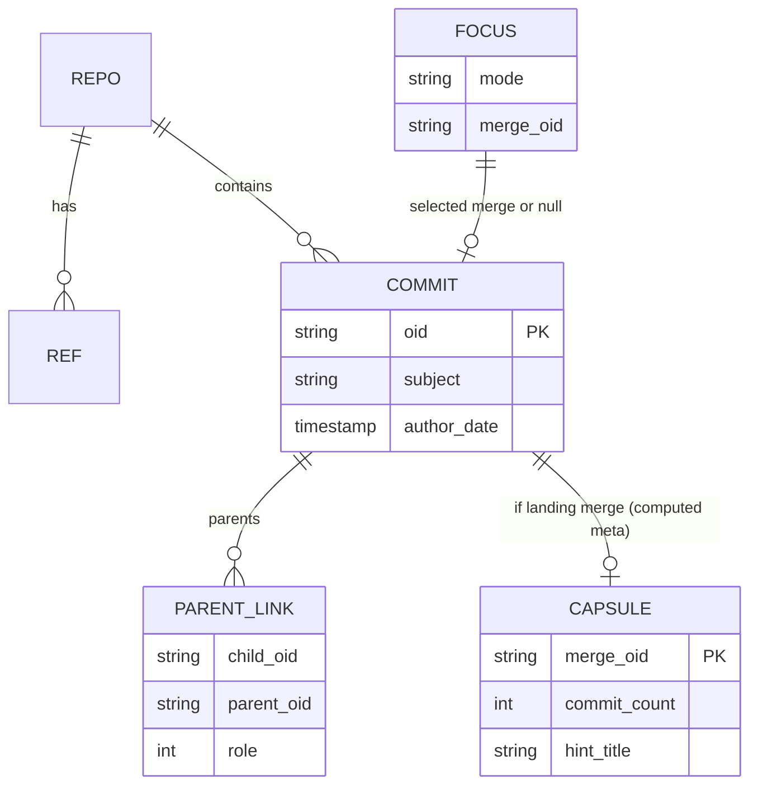

# GitSpine — First-Parent Git History Visualizer

| Field | Value |
|-------|--------|
| **Document** | Architecture & Design |
| **Product** | GitSpine (module: `github.com/byo/gitspine`) |
| **Author** | TBD |
| **Date** | 2026-07-30 |
| **Status** | Draft (revised: local-only scope + residual review fixes) |
| **Audience** | Senior engineers implementing the POC and beyond |

---

## Overview

**GitSpine** is an interactive web app that visualizes git history with a deliberate mental model: **first-parent history is the primary spine**; merge commits are *landing points* for features, not noise. Standard merge commits preserve when work started, how it was synchronized, and how it landed on main. The problem is not that merge DAGs are inherently unusable — it is that most UIs treat all edges as equal, so second-parent ancestry reads as visual chaos.

GitSpine splits the DAG by purpose:

- **First-parent edges** on the main line = “what landed on the integration branch, in order.”
- **Second-parent (and beyond) edges** = “how that feature was developed,” shown only when the user focuses that feature.

The default view is a clean linear-looking spine (functionally equivalent to “history as if only squash/rebase-merge existed”), with feature subgraphs collapsed into compact **merge capsules**. Selecting a merge expands and emphasizes that feature’s commits using **only plain git history** (merge-range semantics: `M^1..M^2`); everything else stays de-emphasized. The architecture is greenfield: Go API server + TypeScript React SPA, reading a **local git repository** (current working directory or `--repo` path). An abstract `RepositoryProvider` exists for **testability** (fake in-memory DAGs) and optional future extension—not as a near-term multi-forge product plan.

This document specifies the full product architecture, a concrete visualization grammar, rigorous feature-bundle membership from the local commit DAG, lazy-loading APIs, performance strategy for medium local histories, a stepped POC path, and an incremental PR plan.

**Product scope (FINAL):** POC and near-term = **local folder git repo only**. Get as much as possible from plain git history. Assume history is **well structured** (proper merge commits; first-parent discipline generally correct). Remote forges / PR association are **out of scope**.

**POC scale target:** comfortable on **10k–50k** commit local repos (S6). Architecture choices (lazy spine, no full-DAG layout, range primitives, optional CLI `rev-list`) keep larger histories from being a dead end; multi-million-commit stress is optional, not a v1 guarantee.

---

## Background & Motivation

### Current state of git history UX

Common tools expose one of two extremes:

| Tool / mode | Strength | Weakness relative to GitSpine’s thesis |
|-------------|----------|-------------------------------------|
| `git log --oneline --graph` | Honest DAG | All edges equal; ASCII layout fights multi-branch noise |
| GitHub / GitLab graphs | Pretty lanes | Emphasize branch topology more than first-parent “product history” |
| GitKraken / GitLens | Powerful graphs | Expert tools; still treat feature commits as same-weight graph ink |
| Squash / rebase-merge workflows | Clean linear log | Erase feature development structure and timing relative to main |

Teams often adopt squash or rebase-onto-main **because the default visualizations make merges look messy**, not because merges are worse for history. GitSpine aims to reverse that incentive: make correct merge history *easier* to read than a flat squash list, while still offering a first-parent spine that matches the “clean main” mental model.

### Pain points GitSpine targets

1. **Equal edge weight** — second-parent edges look like first-parent edges, so the eye cannot find the product timeline.
2. **No hierarchical focus** — you cannot say “show me whole-repo spine” vs “show me *this* feature’s development.”
3. **Eager full-graph load** — long histories force either truncation or multi-second freezes when UIs load the full DAG.
4. **Weak merge semantics** — octopus merges, FF merges, and stacked features are rarely given explicit visual roles in existing UIs, even when the local DAG already encodes them.

### Why now (POC)

A POC can validate the **visualization thesis** against a **local** repo with intentional merge history (and later real project checkouts) before investing in WebGL, multi-feature colors, or any remote hosting integration. If first-parent spine + expand-on-select feels right, the rest of the stack is justified. **Thesis gate is S4/S5** (capsules + expand UX), not large-repo work.

### Product success metric (thesis)

After a 5-minute guided demo on the intentional merge fixture, a developer who is not a git graph expert can correctly answer: “What landed on main, and what commits were unique to feature X?” without reading `git log --graph` ASCII. Secondary eng metric: expand of a ≤50-commit feature feels interactive (server expand p95 &lt; 500ms on local SSD for that size).

---

## Goals & Non-Goals

### Goals

1. **First-parent as primary narrative** — default view is main-branch first-parent history with low visual weight on merged-in paths.
2. **Feature focus** — selecting a merge commit expands/emphasizes commits introduced by that merge (range `M^1..M^{2..n}`) and de-emphasizes others.
3. **Clear visual grammar** — distinct rendering for first-parent vs second-parent edges, merge capsules, and focus states (default / hover / select).
4. **Abstract local git access** — `RepositoryProvider` with range primitives; **LocalGitProvider** (go-git + CLI fast path) is the only production implementation for the POC. Abstraction exists for **fake-provider unit tests** and long-term extensibility, not a near-term forge roadmap.
5. **Lazy / demand-driven loading** — load spine pages and expand feature subgraphs on demand; **POC comfort target 10k–50k commits**.
6. **Interactive web app** — Go backend + React (TypeScript) frontend; keyboard- and mouse-friendly graph.
7. **POC-first delivery** — stepped path so the visualization approach is demoable early on local fixtures and real local clones (see Rollout / PR Plan).

### Non-Goals (POC and near-term)

- **Not remote forges** — no GitHub / GitLab / Forgejo / Bitbucket providers, no OAuth, no PR/MR association, no “PR commit list” membership model. (One-line future note only: a remote provider *could* implement the same interface later; it is not planned work.)
- Not a full Git GUI (staging, commit, push, conflict resolution).
- Not a replacement for `git bisect` / blame workflows (may link out later).
- Not multi-user collaboration or hosted SaaS auth.
- Not perfect layout for pathological graphs (thousands of simultaneous active branches).
- Not full cross-feature dependency coloring in POC (deferred nice-to-have).
- **Not nested feature focus** — expanding a feature does not allow focusing a merge *inside* that feature as a child focus; nested merges are flattened in the lane (post-POC open).
- Not rewriting git history or suggesting rewrite policies.
- Not offline PWA / mobile-first design (desktop browser primary).
- Not real-time watching of `git fetch` in POC (manual refresh is fine).
- **Not files-changed / tree-diff UI in POC** — detail panel shows message, parents, refs only.
- **Not multi-million-commit performance guarantees in POC** — optional stretch after S5.
- **Not wrong-first-parent auto-repair or detection focus** — POC **assumes well-structured history** (FP = integration line, second parent = feature tip). Heuristics remain optional far-future polish, not a design workstream.
- **Not crossing-minimization / dual list+mini-graph fallbacks in POC** — always single-column feature lane.

---

## Proposed Design

### Product name & positioning

- **Product name:** GitSpine  
- **Module / CLI:** `github.com/byo/gitspine` / `gitspine`  
- **One-liner:** *Merge history you can actually read — first-parent spine, features on demand.*

### High-level architecture



**Process model (POC):** single binary or `make dev` running:

1. Go server binds `127.0.0.1:8080` by default, serves API under `/api/v1/*` and (production) static SPA via `go:embed`.
2. Working directory (or `--repo` flag) is the **local** git repository root for `LocalGitProvider`.
3. SPA talks only to the abstract API — never invokes `git` in the browser.
4. Dev: Vite proxies `/api` → Go; production: one binary serves API + embedded assets.

### Core mental model: spine vs feature bundles



Definitions used throughout the system:

| Term | Definition |
|------|------------|
| **Integration branch** | Tip used as spine root. **POC default resolution** when `--ref` omitted: (1) if `HEAD` is a branch, use that branch; (2) else try `refs/heads/main`, `refs/heads/master`, `refs/heads/trunk` in order; (3) else use `HEAD` OID (detached) and set `detached: true`. Explicit `--ref` / `GITSPINE_REF` always wins. |
| **Spine commit** | Commit reachable by walking **first parent only** from the integration tip. |
| **Landing merge** | Spine commit with ≥2 parents (typically merge into integration). |
| **Feature bundle** | Commits **reachable from any non-first parent of landing merge M, excluding commits reachable from M’s first parent** — i.e. git range semantics. See [Semantic specification](#semantic-specification-normative). |
| **Focus** | UI mode: either `spine` (whole-repo primary view) or `feature:<mergeOid>` (one emphasized feature). POC: **exactly one** feature focus max; **no nested focus**. |
| **Capsule** | Compact visual attachment on a landing merge representing a collapsed feature bundle (count, optional title from subject / branch ref). |
| **Generation** | Monotonic server counter bumped on refresh / integration tip change; invalidates cursors and client page caches. |

### Visualization UX (primary differentiator)

This section defines the **visual grammar** and interaction model. Implementation must preserve these semantics even if drawing technology changes.

#### 1. Visual grammar

**A. Primary spine (always present)**

- **Vertical main rail, newest at top** (POC ship default; layout engine may keep a horizontal mode flag unused).
- Spine nodes: solid, high-contrast discs (or rounded pills for merges).
- **First-parent edges:** thick, solid, high-opacity stroke along the rail. These edges mean “product timeline advanced.”
- Spacing: uniform in **topological / spine-index space**, not raw author-date space. Optional faint date labels on the **left gutter**.

**B. Secondary feature material (default: collapsed)**

- Non-spine commits are **not** drawn as a full side graph by default.
- Each landing merge shows a **merge capsule** on the **right** side of the rail (tags/dates use left gutter — no collision):
  - Small rounded rect connected by a short **second-parent stub** (horizontal jog ~24–32px from node center to capsule).
  - Label: prefer `hintTitle` (parsed from merge subject); else `+N` / `+N+` if approximate.
  - Fill: low-saturation / transparent (e.g. 25–35% opacity).
  - Capsule is clickable/focusable = “select this feature.”
  - **Octopus (POC):** one capsule, label like `3 tips · +N` (combined count); optional tiny p2..pN hash marks on the stub fan.

**C. Expanded feature lane (on feature focus)**

- Capsule **expands into a single side column** attached at the merge (right of rail):
  - Feature commits full opacity; spine outside landing merge slightly dimmed.
  - Internal edges: medium solid, feature accent.
  - **Landing edges:** from each non-first parent tip (bundle root) into merge M — medium accent, arrowhead into M.
  - **Sync / boundary edges** (parent outside bundle): dashed, thin; drawn only if both endpoints are in the loaded subgraph or the parent is the excluded base side; **cap at K=8** dashed bridges, then show “+N more links” badge (no more dashed lines).
  - Nested merges inside the feature: drawn as ordinary feature nodes (double-ring if merge); **no sub-capsules, no nested focus**.
- Unrelated capsules remain collapsed and further dimmed (~15% opacity).

**D. Edge roles (must look different)**

| Edge role | Geometry | Stroke | Meaning |
|-----------|----------|--------|---------|
| Spine first-parent | Along main rail | Thick solid, primary color | Timeline of integration |
| Feature-internal | Inside expanded lane | Medium solid, feature accent | How the feature evolved (`Edge.Kind = internal`) |
| Landing non-first-parent | Fan-in to merge M | Medium accent, arrow into M | “This tip landed” (`Kind = landing`) |
| Boundary / sync | Parent outside bundle | Dashed / thin; max K drawn | Link to history not in bundle (`Kind = boundary`) |
| Octopus Nth parents | Multiple landing edges p2..pN | Same as landing, ordered by parent index | Multiple tips landed together |

**E. Node roles**

| Node | Shape | Default | Focused feature |
|------|-------|---------|-----------------|
| Ordinary spine commit | Circle | Opaque | Slightly dimmed if not landing |
| Landing merge | Double-ring circle | Opaque + capsule | Strong highlight + expanded lane |
| Feature commit | Smaller circle | Hidden / in capsule count | Opaque in lane |
| Fast-forward tip advance | Circle (no capsule) | Opaque | N/A — no second parent |
| Tag / release annotation | Flag on **left** gutter | Visible for tags on spine | Unchanged |
| Branch tip labels | Soft chip near tip node | Integration tip | Optional |

#### 2. Default vs hover vs select

| State | Spine | Capsules / features | Detail chrome |
|-------|-------|---------------------|---------------|
| **Default (focus = spine)** | Full opacity rail | Collapsed capsules, low opacity; no full feature paths | Truncated subjects on rail optional |
| **Hover commit** | Scale + tooltip (short oid, subject, author, date) | Hover capsule: tooltip with `hintTitle` + count (`12` or `500+`); **no ghost lane outline** in POC | Tooltip only; no layout jump |
| **Hover edge** | Tooltip of parent role / edge kind | — | — |
| **Select spine commit** | Selection ring; detail panel (full message, parents with roles, refs) | Unchanged | Side panel — **no files-changed in POC** |
| **Select landing merge / capsule (= feature focus)** | Landing merge highlighted; other spine slightly dimmed | **That** feature expands; other capsules dim more | Panel: feature summary, commit list, “Exit feature focus” |
| **Exit focus** | Restore default | Collapse lane (instant if `prefers-reduced-motion`, else short morph) | Clear feature context |

**Focus principle (invariant):** at any time the user focuses either the **whole-repo spine** or **exactly one feature**. Nested focus is a **non-goal for POC**.

#### 3. Collapse / expand of feature subgraphs

**Collapse (default):**

- Spine response may include capsule metadata (`commitCount` or null if deferred, `mergeOid`, `hintTitle`, `countExact`).
- Client draws capsule only; **does not** request full feature commit list until expand.

**Expand (feature focus):**

1. Client `GET /features/{mergeOid}/expand`.
2. Server returns feature commits + edges (internal / landing / boundary) using **merge-range membership** only (below).
3. Client runs **local single-column lane layout** (does not re-layout entire spine).
4. **Gap insert + scroll anchor** (see §7).

**Re-collapse:** drop feature geometry; keep spine pagination state; optional free of expand cache.

#### ASCII wireframe (rail + capsule + expanded lane)

```
 LEFT GUTTER          SPINE RAIL                    RIGHT (features)
 ─────────────        ──────────                    ────────────────
 Jul 2026               ●  abc  tip main
                        │
                        ●  def  docs: readme
                        │
 tag v1.2 ───           ◉  M1   Merge branch 'feat/login'   ──stub── [ feat/login +12 ]
                        │                                         (collapsed capsule)
                        ●  ghi  chore: bump ci
                        │
                        ◉  M2   Merge branch 'feat/api'      ──stub── [ feat/api +8 ]
                        │

 === after focus M1 (gap inserted under M1) ===

                        ●  def
                        │
 tag v1.2 ───           ◉  M1  ◄══ accent ring ════════════╗
                        │         landing edges             ║  f3  (2nd parent tip)
                        │                                   ║  f2
                        │                                   ║  f1
                        │         (lane column, topo)       ╚══ ends above next spine
                   [gap]
                        ●  ghi   (dimmed)
                        │
                        ◉  M2   ── [ feat/api +8 ]  (more dimmed)
```

#### 4. Time axis vs topological axis

**Decision for POC: topological spine index as primary Y axis** (newest = index 0 at top).

Rationale: author dates are non-monotonic; first-parent order is the product narrative. Date is a **secondary left gutter** (boundary ticks only). Feature lanes use topological levels within the bundle (see layout).

#### 5. Special cases (summary)

| Case | Behavior |
|------|----------|
| **Fast-forward** | No merge node special case, no capsule; spine advances. |
| **True merge (2 parents)** | Landing merge + one capsule; expand = `M^1..M^2`. |
| **Octopus** | One capsule (combined); expand = union of `M^1..M^k` for k≥2; multi-root column tops ordered by parent index. |
| **Empty / degenerate merge** | **Hide capsule** if count is 0 and exact; still show merge node. If count unknown, show capsule without number until filled. |
| **Tags** | Left gutter markers; message in detail panel. |
| **Branch tips** | Chip on integration tip; other tips when they point at visible commits. |
| **Detached HEAD** | Banner; spine from resolved integration ref / OID. |
| **Linear history** | Pure spine; still useful. |
| **Wrong first-parent order** | **Out of focus for POC.** Assume well-structured merges (FP = integration). Spine still renders whatever FP walk produces; no detector, no auto-fix. |
| **Shallow clone** | If walk hits missing object / shallow boundary: return partial results with `truncated: true` / warning banner “shallow repository; history incomplete.” |
| **Replace / grafts** | Local provider uses git’s resolved view (go-git or CLI as configured); no special UI. Document that replace refs may surprise. |
| **Root commit** | First-parent walk ends; `hasMore: false`. Orphan roots inside a feature bundle are valid column tops. |
| **spineIndex after refresh** | Indices are **per generation**. Refresh bumps `generation`; client **drops all spine pages** and reloads from tip. Do not reuse cursors across generations. |

#### 6. Accessibility & cognitive load

- **Max simultaneous emphasized features (POC):** 1.
- **Color is not the only channel:** thickness, opacity, shape, labels, selection rings.
- **Keyboard:** ↑/↓ along spine (or feature list when focused); `Enter` on merge expands; `Escape` exits; `/` search.
- **Motion:** `prefers-reduced-motion` → instant expand/collapse.
- **Screen reader:** parallel list of current focus set always synced with selection.
- **Cognitive load:** paginate expand if huge; virtualize long lanes; never draw unbounded dashed sync edges (cap K=8).

#### 7. Layout algorithm choices

**Spine layout (client):**

1. Server returns ordered spine slice (newest-first) with stable `spineIndex` **within `generation`**.
2. Base position: `baseY(i) = i * rowPitch` (e.g. `rowPitch = 28`).
3. **GapMap:** when feature focus on landing merge at index `i`, insert gap after that node:

```
laneHeight = max(minCount, laidOutFeatureRows) * featureRowPitch + padding
// minCount = capsule commitCount when known, else laidOutFeatureRows only

worldY(j) =
  baseY(j)                           if j <= i
  baseY(j) + laneHeight              if j > i

// Scroll anchoring on expand (keep landing merge fixed in viewport):
// before: screenY_M = worldY(i) - scrollTop
// after gap: set scrollTop' = worldY'(i) - screenY_M
// If neighboring spine pages are not loaded, only anchor using currently
// mounted window; do not invent off-window geometry.
```

4. No Sugiyama on the full DAG for default view.

**Feature lane layout (client, on expand) — POC only:**

**Normative visual + serialization (Issue 15 — single rule set):**

| Concern | Rule |
|---------|------|
| **Lane geometry** | Single column, right of rail. **Tip(s) adjacent to M** (smallest distance to the landing merge). Distance from M increases toward **older ancestors** (deeper into the GapMap). |
| **Parent vs child in the lane** | A **parent commit is farther from M** than its child (child is newer / closer to landing). Do **not** say “parent is level above child.” |
| **Roots** | Non-first parents of M (`P1…P_{n-1}`). Octopus: order roots by **parent index** ascending (p2, p3, …) as parallel tops nearest M. Still emit landing edges if a tip is not itself in the bundle set. |
| **Level assignment** | Longest-path distance *from the tip roots toward older history* (or equivalently: topo rank where tips rank 0, their parents rank 1, …). Higher rank → larger `worldY` offset into the gap. |
| **API serialization order** | Stable topo **tips/roots first**, then toward older parents (same order as walking away from M). Pagination continues this order. |

- **No crossing-minimization fallback**, no second “list+mini-graph” UI in POC. Messy feature graphs still use one column; detail list for reading order.
- Hit-testing POC: spine Y ranges + capsule AABBs + feature node positions map; no DOM per node.

```mermaid
sequenceDiagram
  participant U as User
  participant UI as Graph UI
  participant API as Graph API
  participant P as Provider

  U->>UI: Open app
  UI->>API: GET /spine?cursor=&limit=50
  API->>P: WalkFirstParent / page
  P-->>API: commits
  Note over API: Capsules: tiered fill (see Performance)
  API-->>UI: spine page + generation + capsules
  UI->>UI: Layout rail + capsules

  U->>UI: Click capsule on merge M
  UI->>API: GET /features/M/expand?limit=200
  API->>P: WalkExclude(tips=M^2.., exclude=M^1)
  P-->>API: feature commits
  Note over API: Emit internal+boundary from walk; always append landing edges M→Pk
  API-->>UI: FeatureSubgraph (merge-range)
  UI->>UI: GapMap + scroll anchor; focus=feature:M

  U->>UI: Escape
  UI->>UI: Collapse lane, focus=spine
```

### Semantic specification (normative)

This subsection is **normative for POC**. Graph service and tests must agree with it.

#### Feature-bundle membership (merge-range)

For landing merge `M` with parents `P0, P1, …, P_{n-1}` (`P0` = first parent):

```
# Two-parent (n = 2): classic git range
bundle(M) = rev-list(P1) ∖ rev-list(P0)
          ≡ commits reachable from P1 but not from P0
          ≡ `git rev-list P0..P1`   # i.e. M^1..M^2

# Octopus (n > 2): union of ranges against first parent
bundle(M) = ⋃_{k=1..n-1} ( rev-list(Pk) ∖ rev-list(P0) )
          ≡ `git rev-list P0..P1 P0..P2 …` (reachable from any Pk, k≥1; not from P0)
```

**Not used as primary definition:** “stop when commit ∈ first-parent spineSet.” SpineSet is **not equivalent** to `ancestors(P0)` in general (side-branch commits merged earlier are ancestors of `P0` via second parents of older merges, but are not themselves on the FP spine). Using spineSet **over-includes** stacked features and shared topic history.

**POC shared-commit default:** pure reachability as above — **no exclusive “claim by first capsule.”** The same commit OID **may appear in multiple bundles** if it is in multiple merge ranges (uncommon for mainline merges; possible with unusual topologies). UI does not dual-color in POC; each expand is independent. No `--ancestry-path` filter in POC (optional later for “only along path to M”).

**`M` itself is not in the bundle** (it is the landing spine node). Bundle commits are the feature side only.

#### Edge inclusion in expand payload

| Kind | Rule |
|------|------|
| `internal` | Both endpoints ∈ bundle; `Role` = parent index of `To` in `From`’s parent list. Produced from parent links discovered during / after `WalkExclude`. |
| `landing` | **Synthesized by the graph service after the walk** — not produced by walking the bundle alone. **Always** emit one landing edge per non-first parent: `from=M, to=Pk, role=k, kind=landing` for every `k≥1`, **even if `Pk ∉ bundle`** (empty/degenerate or tip-only cases). |
| `boundary` | `From` ∈ bundle, `To` ∉ bundle (typically parent on the `P0` side or other excluded history). Include up to a server cap; client draws ≤K. |

**Edge orientation:** `Edge.From` = child commit, `Edge.To` = **parent** commit (git-native). UI draws line from child toward parent. On the vertical rail (newest at top), that is generally **upward** toward older history on the spine; in the feature lane, landing edges connect M to tips that sit **just below** M in the gap (tip adjacent to M).

#### Capsule count

```
count(M) = |bundle(M)|   # same membership
```

With budget: if walk/count stops early → `countExact: false`, report lower bound and display `N+`.

#### Sync merges (feature merged main)

If the feature branch merged main during development, those merge commits and any commits **not** reachable from `M^1` stay in the bundle; commits that **are** reachable from `M^1` are excluded by range semantics. Boundary dashed edges show links from feature commits to excluded mainline parents. **POC visual:** draw up to K=8 boundary edges; no “synced N times” badge required (optional post-POC).

#### Nested merges inside a feature

Included if in `bundle(M)`. Flattened in one column; **no nested capsules / nested focus**.

#### Octopus multi-root layout

- Membership: union formula above.
- Capsule: single combined count.
- Lane tops: each `Pk` (k≥1) that is either in the bundle or is a direct parent of M; order by k ascending.
- Fan-in: one landing edge per non-first parent.

#### Wrong first-parent discipline

- Spine = whatever FP walk produces; **may be misleading**.
- POC: no detector. README documents “merge into integration from feature so first parent stays on integration.”
- Post-POC optional heuristic: e.g. if `P0` is not an ancestor of previous spine tip via FP-only chain discontinuity — warn banner. **Out of scope for POC implementation.**

#### Expand on non-merge

HTTP **400** `not_a_merge` if `len(parents) < 2`.

#### Fixtures required for membership tests

| Fixture | Expectation |
|---------|-------------|
| **Simple feature** | Main… merge M of `feat`; bundle = feature commits only; count matches `git rev-list --count M^1..M^2`. |
| **Sync merges** | Feature merged main mid-way; main commits not in bundle; feature unique commits + feature-side merge commits in bundle. |
| **Stacked PR** | Feature B based on A; A merged then B merged. Expand B **must not** include A’s commits already reachable from `B^1` (main after A). Expand A includes A’s commits only. |
| **Octopus** | Union of sides; no first-parent-only commits. |
| **Commit merged twice** | Unusual re-merge; each expand uses its own range; no global claim table. |
| **Empty merge** | `git merge -s ours` or equivalent; count 0; hide capsule. |
| **FF only** | No merge commit; no capsule. |

### Backend architecture (Go)

**Suggested module layout:**

```
/cmd/gitspine/               # main: flags, HTTP server, static embed
/internal/api/               # HTTP handlers, middleware, DTOs
/internal/graph/             # spine walk, capsule, expand, search
/internal/provider/          # RepositoryProvider interface + capabilities
/internal/provider/local/    # LocalGitProvider (go-git + CLI rev-list)
/internal/provider/fake/     # in-memory provider for unit tests
/internal/cache/             # OID → commit summary LRU; capsule count cache
/internal/model/             # shared domain types
/scripts/                    # gen-fixture-repo.sh, gen-demo-repo.sh
/web/                        # React SPA
/testdata/                   # golden expectations (optional JSON)
```

**Domain types (conceptual):**

```go
// internal/model/types.go (illustrative)

type OID string

// Role is the parent index in the child commit's parent list:
// 0 = first parent, 1 = second parent, ...
type ParentLink struct {
    OID  OID `json:"oid"`
    Role int `json:"role"`
}

type CommitSummary struct {
    OID           OID          `json:"oid"`
    ShortOID      string       `json:"shortOid"`
    Subject       string       `json:"subject"` // first line of message, trimmed
    AuthorName    string       `json:"authorName"`
    AuthorEmail   string       `json:"authorEmail"`
    AuthorDate    time.Time    `json:"authorDate"`
    CommitterDate time.Time    `json:"committerDate"`
    Parents       []ParentLink `json:"parents"`
    // IsMerge is denormalized convenience: len(Parents) > 1.
    // Clients may recompute; server always sets consistently.
    IsMerge bool `json:"isMerge"`
}

type Capsule struct {
    MergeOID    OID    `json:"mergeOid"`
    // CommitCount may be 0 with CountExact true (empty); or omitted/null when deferred.
    CommitCount *int   `json:"commitCount"` // null = not yet computed
    HintTitle   string `json:"hintTitle,omitempty"`
    CountExact  bool   `json:"countExact"`
}

type SpineNode struct {
    Commit     CommitSummary `json:"commit"`
    Capsule    *Capsule      `json:"capsule,omitempty"` // nil for non-merges; empty-merge may omit
    SpineIndex int64         `json:"spineIndex"`        // 0 = integration tip; increases toward older
}

type EdgeKind string // "internal" | "landing" | "boundary"

type Edge struct {
    From OID      `json:"from"` // child
    To   OID      `json:"to"`   // parent (git-native)
    Role int      `json:"role"` // parent index on child
    Kind EdgeKind `json:"kind"`
}

type FeatureSubgraph struct {
    MergeOID   OID             `json:"mergeOid"`
    Commits    []CommitSummary `json:"commits"`
    Edges      []Edge          `json:"edges"`
    Truncated  bool            `json:"truncated"`
    NextCursor string          `json:"nextCursor,omitempty"`
    // Commits order (normative): tips/roots first, then older ancestors
    // (same as lane: tips adjacent to M, parents farther from M).
}
```

**Subject mapping:** `Subject = first line of Commit.Message`, trimmed, without trailing newline. Full message only on `GET /commits/{oid}`.

**Graph service responsibilities:**

1. Resolve integration tip (see default algorithm).
2. First-parent walk with cursor pagination.
3. Capsule stats via **tiered strategy** (Performance) — never unbounded per-merge walks on the hot path.
4. Expand via `WalkExclude` / merge-range; batch commit loads; **always append landing edges** for each non-first parent of M.
5. Commit detail (message body, refs).
6. Bounded search over local spine window.
7. Generation bump on refresh.

**Local provider implementation notes:**

- **Hybrid (Key Decision):** **go-git** for open repo, ref resolve, single/batch commit read, first-parent walk for moderate pages; **`git rev-list` CLI** for `CountExclude` and optionally `WalkExclude` when `git` binary is available (fast path using commit-graph if present).
- If `git` missing: pure go-git walk with budgets; document scale ceiling.
- Detect bare vs non-bare; refuse non-repos.
- Stream-friendly; no full history load at startup.
- Optional spine index: `[]OID` newest-first + `map[OID]int64` for index lookup; built in background after first paint.

### Abstract repository provider

```go
// internal/provider/provider.go

type Ref struct {
    Name string // e.g. refs/heads/main
    OID  model.OID
}

type Commit struct {
    OID        model.OID
    ParentOIDs []model.OID // index 0 = first parent
    TreeOID    model.OID
    Author     Signature
    Committer  Signature
    Message    string // full raw message
}

type Signature struct {
    Name  string
    Email string
    When  time.Time
}

type ListRefsOptions struct {
    Heads  bool   // include refs/heads/*
    Tags   bool   // include refs/tags/*
    Prefix string // optional prefix filter
    Limit  int    // 0 = provider default cap
}

type ProviderCapabilities struct {
    // SupportsRangeExclude: WalkExclude / CountExclude implemented efficiently.
    SupportsRangeExclude bool `json:"supportsRangeExclude"`
    // SupportsRangeCountCLI: local git rev-list --count available.
    SupportsRangeCountCLI bool `json:"supportsRangeCountCLI"`
}

type RepoIdentity struct {
    // Cache key: canonical absolute path of the local repo.
    RepoID string
    // Tip of integration ref at open / last refresh.
    IntegrationOID model.OID
    Generation     uint64
}

// RepositoryProvider is the sole boundary to git object/ref data.
// POC production impl: LocalGitProvider. Tests: FakeProvider.
// Rationale for the interface: unit-test graph logic without a real .git,
// and leave a clean seam if remote access is ever desired later (not planned).
type RepositoryProvider interface {
    Identity(ctx context.Context) (RepoIdentity, error)
    Capabilities() ProviderCapabilities

    ResolveRef(ctx context.Context, ref string) (model.OID, error)
    GetCommit(ctx context.Context, oid model.OID) (*Commit, error)
    // GetCommits: graph service MUST use this for multi-OID loads (batch).
    GetCommits(ctx context.Context, oids []model.OID) (map[model.OID]*Commit, error)

    ListRefs(ctx context.Context, opts ListRefsOptions) ([]Ref, error)

    WalkFirstParent(ctx context.Context, tip model.OID, visit func(c *Commit) error) error

    // WalkExclude visits commits reachable from any tip in tips, excluding
    // commits reachable from any tip in excludeTips (git rev-list tips --not excludeTips).
    // Visit order: implementation-defined but deterministic; graph service
    // re-sorts to tips-first API order.
    WalkExclude(ctx context.Context, tips, excludeTips []model.OID, visit func(c *Commit) error) error

    // CountExclude returns |WalkExclude set|, stopping early at budget if budget > 0.
    // exact=false if capped by budget or shallow truncation.
    CountExclude(ctx context.Context, tips, excludeTips []model.OID, budget int) (n int, exact bool, err error)

    // Refresh re-reads tips / clears provider-level caches; bumps generation.
    Refresh(ctx context.Context) error
}
```

**Graph service requirement:** never expand/count by looping `GetCommit` one-by-one when `WalkExclude`/`CountExclude` exist; always batch remaining hydration via `GetCommits` (e.g. chunks of 64–256). After `WalkExclude`, **always synthesize landing edges** for every non-first parent of M.

**Interface constraints (local POC):**

- Local impl holds filesystem path privately (not part of the interface methods’ inputs per request).
- Context on every call.
- Pagination is graph service’s job.
- Membership is **always** git merge-range from the local DAG — no alternate PR-list model in the API.

**No DiffFileSummary in POC** — files-changed out of UI scope.

### API design (lazy graph loading)

Base path: `/api/v1`. JSON, UTF-8.

**Error shape:**

```json
{ "error": { "code": "not_a_merge", "message": "oid is not a merge commit" } }
```

**Error codes (POC):**

| Code | HTTP | When |
|------|------|------|
| `repo_not_found` | 404 | path missing / not a git repo |
| `invalid_ref` | 400 | ref syntax or resolve failure |
| `oid_not_found` | 404 | unknown object |
| `not_a_merge` | 400 | expand on non-merge |
| `invalid_cursor` | 400 | cursor malformed or wrong generation |
| `invalid_limit` | 400 | limit out of range |
| `shallow_truncated` | 200 with flags or 206 optional | prefer body `truncated` + warning header/log |
| `internal` | 500 | unexpected |

#### `GET /api/v1/repo`

```json
{
  "provider": "local",
  "path": "/home/user/proj",
  "repoId": "/home/user/proj",
  "integrationRef": "refs/heads/main",
  "integrationOid": "abc…",
  "headOid": "def…",
  "detached": false,
  "generation": 3,
  "capabilities": {
    "supportsRangeExclude": true,
    "supportsRangeCountCLI": true
  },
  "approximateCommitCount": null
}
```

`approximateCommitCount`: **null in POC** unless cheap (e.g. optional `git rev-list --count` background); never block startup to fill it.

#### `GET /api/v1/spine`

| Query | Description |
|-------|-------------|
| `ref` | Override integration ref (optional) |
| `cursor` | Empty = from tip; else continue older |
| `limit` | Default 50, max 200 |
| `includeCapsules` | default true |
| `capsuleMode` | `defer` (default) \| `sync` — see Performance |

Response:

```json
{
  "generation": 3,
  "integrationOid": "…",
  "nodes": [ /* SpineNode… */ ],
  "nextCursor": "v1:fp:3:<oid>",
  "hasMore": true,
  "capsulesStatus": "partial"
}
```

**Cursor (frozen for POC):**

```
v1:fp:{generation}:{oid}
```

- Means: “continue first-parent walk **older than** `oid`.”
- Reject if `generation` ≠ current → `invalid_cursor` (client must reload from tip).
- Do not encode spineIndex alone (shifts within a generation only if tip fixed; OID is safer).

**Capsule fields on nodes:** with `capsuleMode=defer` (default), first response may set `capsule.commitCount: null`, `countExact: false`, still include `hintTitle` from subject parse; client paints `…` or title-only. Follow-up: same spine response may fill counts asynchronously via **optional** `GET /api/v1/spine/capsules?oids=…` **or** server fills up to budget in-request (see Performance). POC may implement in-request tier only without extra endpoint if simpler — but must not exceed page time budget.

#### `GET /api/v1/features/{mergeOid}/expand`

| Query | Description |
|-------|-------------|
| `limit` | Max commits (default 200, max 2000) |
| `cursor` | Optional; opaque `v1:ex:{generation}:{mergeOid}:{token}` |

**Commit order (normative):** stable topo **tips/roots first**, then older ancestors (matches lane: tips adjacent to M, parents farther from M). Pagination continues the same order.

Response: `FeatureSubgraph` + `generation`. Truncation sets `truncated: true` and `nextCursor`. Edges always include synthesized **landing** edges for each non-first parent of M.

#### `GET /api/v1/commits/{oid}`

Full message body, parents, refs pointing at commit (heads/tags, capped). **No diff/files list in POC.**

#### `GET /api/v1/search?q=`

OID prefix, then subject substring over: loaded spine window on server (e.g. last 2000 spine commits if indexed) + currently not tracking client expand — **POC: spine index prefix only** if index ready; else last N spine from tip. Document limitation in UI placeholder.

#### `POST /api/v1/refresh`

Calls `provider.Refresh`; bumps generation; clears graph caches. Returns new `/repo` snapshot.

**CORS:** enable `http://localhost:<vite>` only when `GITSPINE_DEV=1` or `--dev`; **production single-origin embed: CORS off**.

**Deep links:** post-POC / optional PR — `?select=<oid>&focus=<mergeOid>`; not required for S5. Frontend route `/` only in early PRs.

**Why not GraphQL for POC:** REST matches pages + expand; smaller surface.

### Frontend graph rendering approach

| Layer | Choice | Rationale |
|-------|--------|-----------|
| Framework | **React + TypeScript** | Ecosystem; canvas examples |
| Build | Vite | Dev proxy; production build → `go:embed` |
| State | Zustand | Focus, selection, generation, page cache |
| Graph rendering | **HTML Canvas 2D** (own thin renderer) | Long virtualized spine |
| Virtualization | Window by `worldY` / scroll | Visible ± overscan |
| UI chrome | CSS or Tailwind | Panel, tooltips, a11y list |

**Hit-testing POC:** spine index → Y + capsule AABB + feature nodes; sufficient without R-tree.

**Libraries:** `@tanstack/virtual` for a11y list; avoid D3 force, cytoscape, GitGraph clones.

### Data model summary



**Note:** Bundle membership is **computed** via merge-range on expand/count — not a stored edge from CAPSULE to COMMIT rows. No durable app DB in POC.

### Performance strategy

**POC latency targets (local SSD, warm OS cache, repo ≤50k commits):**

| Operation | Target |
|-----------|--------|
| Spine page (limit 50, warm LRU, deferred capsules) | p95 &lt; 200ms |
| Capsule fill for ≤20 merges with CLI `rev-list --count` | p95 &lt; 300ms additional or parallel |
| Expand ≤200 commits (CLI or go-git) | p95 &lt; 500ms |

**Assumptions:** batch `GetCommits` ≥ 5k commits/sec go-git local SSD order-of-magnitude; CLI `rev-list --count` typically &lt;50ms when commit-graph exists. **Measure in PR 10** (and re-check at S6 soak); do not treat as SLA.

#### Capsule strategy (tiers)

1. **Tier A — Paint first:** Spine nodes returned immediately; for merges, capsule with `hintTitle` from subject; `commitCount: null` unless cache hit.
2. **Tier B — Per-request budget:** Wall-clock budget **B = 50ms** (configurable) and **max M = 10** exact counts per spine request. Prefer `CountExclude` → local **`git rev-list --count P0..P1 …`**. Remainder stay null / use cached values.
3. **Tier C — Background / lazy:** Client may re-request spine or a thin capsules endpoint for remaining OIDs; or server continues in background and client refresh on next scroll into view.
4. **Budgeted walk (no CLI):** `CountExclude(..., budget=500)` → `countExact: false`, display `500+`.

**Never** run 50 × 500 commit walks on the hot path.

#### Expand path

- `WalkExclude(tips=nonFirstParents, excludeTips=[firstParent])` then hydrate via `GetCommits` batches.
- Derive `internal` / `boundary` edges from parent links; **always append `landing` edges** for every non-first parent of M.
- Cap `limit`; set `truncated`.
- Log `mergeOid`, `n`, `exact`, duration (membership is always local merge-range).

#### Spine index (PR 13 / S6 enabler)

```
type SpineIndex struct {
    Generation     uint64
    IntegrationOID OID
    // Newest-first order matching spineIndex 0..len-1
    OIDs []OID
    // Optional membership for other features — NOT used for bundle membership
    AsSet map[OID]struct{} // len ≈ |OIDs|
}
```

| Repo size | Approx memory (20B OID hex stored as 20-byte raw + map overhead) |
|-----------|-------------------------------------------------------------------|
| 50k commits | ~ few MB — fine |
| 1M commits | tens of MB — acceptable single-process; still stretch |

**When expand allowed:** expand does **not** require full spine index (merge-range uses `M^1` only). Index is for fast spine pagination by offset, search, and optional UI scroll-to.

**Date-based stop:** **forbidden** as a correctness path. No date heuristics for membership or count.

#### Larger local repos (optional stretch)

- Constraints that avoid dead ends: lazy FP pages, no full DAG layout, `WalkExclude`/`CountExclude`, CLI rev-list, virtualization.
- **Not a POC exit criterion.** After S5/S6, optional experiment on a large local clone; profile go-git vs CLI — do not block the visualization thesis.

#### Caching & invalidation

- LRU commit summaries (e.g. 50k entries).
- Capsule counts keyed by `(repoId, generation, mergeOid)`.
- Refresh / tip change → `generation++`, clear capsule cache and spine pages.

### Configuration (server)

```
gitspine --repo /path/to/repo --listen 127.0.0.1:8080 --ref refs/heads/main
gitspine --log-level debug
```

Env: `GITSPINE_REPO`, `GITSPINE_REF`, `GITSPINE_LISTEN`, `GITSPINE_LOG_LEVEL`, `GITSPINE_DEV=1` (CORS for Vite), `GITSPINE_CAPSULE_BUDGET_MS`, `GITSPINE_MAX_FEATURE_COMMITS`.

### Security model (POC)

- Bind **`127.0.0.1`** by default; if user passes `0.0.0.0`, log a **warning**.
- Read-only git access; no write APIs.
- No auth (single-user local tool).
- **`--repo` validation:** open only via go-git/git; **refuse** if not a git repository (no object store). Never expose generic “read file by path.” Symlinks: resolve canonical path once at open; do not follow user-supplied paths outside repo for object access.
- CLI invocations: fixed subcommands (`rev-list`, `rev-parse`); OIDs/refs passed as argv after `--`; no shell interpolation.
- **UI:** all git strings (messages, names, refs) rendered as **plain text** — no markdown rendering in POC (XSS surface closed).
- Production: CORS off; same-origin embed only.
---

## API / Interface Changes

Greenfield — all APIs are new:

| Surface | Description |
|---------|-------------|
| CLI | `gitspine` serve (`--repo`, `--ref`, …) |
| HTTP JSON | `/api/v1/repo`, `/spine`, `/features/{oid}/expand`, `/commits/{oid}`, `/search`, `POST /refresh` |
| Provider | `RepositoryProvider` (`LocalGitProvider` + `FakeProvider`) with range primitives |
| Frontend | `/` graph; deep links optional later |

No git protocol extensions. No hooks required.

---

## Data Model Changes

No durable application DB in POC. Computed models: spine pages, feature subgraphs, session focus. API versioned under `/v1`. Future optional on-disk spine index under `~/.cache/gitspine/` — not required for POC.

---

## Alternatives Considered

### 1. Full DAG layout (GitHub network style) as default

- **Pros:** Familiar; full topology.  
- **Cons:** Equal edge weight; high layout cost; fights thesis.  
- **Decision:** Reject as default.

### 2. Pure client-side git (WASM) with no backend

- **Pros:** Static deploy.  
- **Cons:** Scale and local file-access UX in the browser are awkward for large repos.  
- **Decision:** Reject primary architecture; Go server owns local git.

### 3. Reuse GitKraken / gitgraph.js visuals

- **Pros:** Faster pretty graphs.  
- **Cons:** Wrong grammar for first-parent narrative.  
- **Decision:** Custom rail + capsule layout.

### 4. Squash-simulation view only

- **Pros:** Simplest UI.  
- **Cons:** Erases feature narrative.  
- **Decision:** FP spine default + expand first-class.

### 5. Vue vs React

- **Decision:** React + TS for POC.

### 6. WebGL first

- **Decision:** Canvas 2D + virtualization first.

### 7. CLI-only backend (`git log --first-parent` + `rev-list`) without provider abstraction

- **Pros:** Thinnest local POC; maximum perf via git.  
- **Cons:** Hard to unit-test graph logic without shelling out; couples HTTP layer to CLI; slower to swap pure go-git vs hybrid.  
- **Decision:** **Reject as sole design** — keep `RepositoryProvider` for **testability**; allow CLI **inside** `LocalGitProvider` for range count/walk fast path.

### 8. Server-side layout (API returns x,y)

- **Pros:** Consistent multi-client layout; thinner clients.  
- **Cons:** Slower UX iteration on visual grammar; more chatty APIs for gap/focus.  
- **Decision:** **Client layout for POC**; server returns topology only.

### 9. Native desktop (Wails/Fyne) instead of browser

- **Pros:** Native feel; no CORS.  
- **Cons:** Embedding SPA in Go already gives single-binary local tool; web stack is fine for localhost UI.  
- **Decision:** **Web app first** (local server); desktop shell optional later.

---

## Security & Privacy Considerations

| Threat | Severity | Mitigation |
|--------|----------|------------|
| Exposure of private repo history on LAN | Medium | Default `127.0.0.1`; warn on `0.0.0.0` |
| Path escape / arbitrary file read | Medium | Git-only open; no generic filesystem API; canonical path at start |
| Command injection via ref/OID | Medium | Argv-only CLI; validate ref/OID syntax |
| XSS via commit messages | Low | Plain-text React rendering only; no markdown |
| Cache confusion multi-repo | Low | One local repo per process in POC; `repoId` = canonical path |

Privacy: author emails as in git; no analytics in POC.

---

## Observability

**POC minimum:**

- Structured **slog** with `--log-level` (`debug|info|warn|error`).
- **Request ID** middleware: generate `X-Request-Id` if absent; log on every request.
- Fields: path, duration_ms, generation, limit, `mergeOid` (expand), bundle_n, count_exact, capsule_mode, err code.
- Slow walk log threshold: &gt;200ms.

**Client `?debug=1` overlay fields:**

- `generation`, `focus`, `selectOid`, `visibleSpineRange`, `loadedPages`, `capsuleNullCount`, `featureCommitCount`, `fps`, `gapHeight`

**Expand logging:** always log mergeOid + n + exact + truncated (aids bug reports on “wrong bundle”).

**Metrics (post-POC):** spine/expand latency histograms, cache hit ratio, CLI vs go-git path counters.

---

## Test Strategy

| Layer | What | Where |
|-------|------|-------|
| Unit | Merge-range membership on **fake provider** graphs | `internal/graph/*_test.go` — **mandatory in PR 7** |
| Unit | Cursor parse/generation; capsule budget accounting | `internal/graph`, `internal/api` |
| Integration | `LocalGitProvider` against **`scripts/gen-fixture-repo.sh`** (profiles) | `internal/provider/local` |
| Golden | Expand/count OIDs vs real `git rev-list` for **all matrix rows** (simple, sync, stacked, octopus, empty, FF, double-merge) | Fixture profiles available by **PR 7** (not deferred to demo PR); `testdata/` or computed in test |
| Frontend unit | GapMap + scroll anchor; tips-first lane order (parent farther from M) | `web/src/graph/*.test.ts` |
| Manual | S4/S5 script on local demo repo | README / `scripts/demo-walkthrough.md` |

**Gate:** fake-provider tests mandatory in PR 7; **local git goldens for the full fixture matrix required before S4 acceptance (PR 18).** PR 17 demo script is screenshot/walkthrough only — not the first time stacked/octopus exist as shell fixtures.

CI (PR 1): `go test ./...`, `tsc --noEmit`, fixture script smoke.

---

## Rollout Plan

### Stepped verification path (critical) — local repo only

| Step | Milestone | Success criteria | Primary PR(s) |
|------|-----------|------------------|---------------|
| S0 | Skeleton | Go hello + React blank via proxy; `make dev` | PR 1 |
| S1 | Spine API | FP JSON for local fixture repo | PR 4–5 |
| S2 | Rail UI | Vertical spine; scroll loads more | **PR 12–13** (layout store + canvas rail) |
| S3 | Capsules | Collapsed capsules; counts or deferred `…` | **PR 6** (backend) + **PR 14** (UI capsules; may ship with expand in same PR) |
| S4 | Expand | Click → feature lane; Escape collapses; membership matches local `git rev-list` | PR 7, PR 14 |
| S5 | Visual grammar | Edge roles, dimming, detail panel, keyboard — **no files-changed** | PR 14–15 |
| S6 | Medium local repo | 10k–50k usable (**requires** cache/index + capsule budgets from **PR 10**) | PR 10, then soak |
| S7 | Hardening | Refresh, search MVP, embed single binary, demo walkthrough, S4/S5 acceptance | PR 8–9, PR 16–18 |

Rollout **ends at local POC validation** (S0–S7). No remote-forge milestone.

**Feature flags (env):** `GITSPINE_EXPERIMENTAL_TIME_AXIS`, `GITSPINE_MAX_FEATURE_COMMITS`, `GITSPINE_CAPSULE_BUDGET_MS`.

**Rollback:** revert binary; no data migrations.

**Thesis gate:** S4/S5 on local fixtures/demo before claiming product success or doing large-repo soak (S6).

---

## Key Decisions

| # | Decision | Rationale |
|---|----------|-----------|
| 1 | **Product thesis: first-parent spine + opt-in feature expand** | Fixes “merge mess” without erasing feature history. |
| 2 | **Default collapse into merge capsules** | Cognitive load; hierarchical focus. |
| 3 | **Single feature focus; nested focus non-goal for POC** | Prevents spaghetti; flatten in-lane merges. |
| 4 | **Go backend + React/TS frontend** | Server-side local git + interactive web UX on localhost. |
| 5 | **`RepositoryProvider` with range primitives from day one** | `WalkExclude` / `CountExclude` for correct expand/count; **fake provider for tests**; not a forge roadmap. |
| 6 | **REST lazy APIs: `/spine` + `/features/{oid}/expand`** | Matches interaction model. |
| 7 | **Topological spine axis; vertical rail newest-at-top** | Stable product order; matches `git log` reading. |
| 8 | **Canvas 2D + virtualization** | Adequate for POC scale; simpler than WebGL. |
| 9 | **Custom layout grammar, not generic DAG packer** | Integration narrative ≠ crossing minimization. |
| 10 | **Assume well-structured local merge history** | FP = integration line; 2nd parent = feature tip. No wrong-FP detector in POC. |
| 11 | **Octopus → one combined merge-range bundle** | Simple expand; multi-root column by parent index. |
| 12 | **Read-only, localhost-default security** | Single-user local history browser. |
| 13 | **Feature membership = only local git merge-range (`M^1..M^k`)** | Plain git history; not spineSet stop; no PR commit lists. |
| 14 | **Shared commits: pure reachability, no exclusive claim** | Matches git; simpler tests. |
| 15 | **Integration ref default: HEAD branch → main → master → trunk → detached HEAD** | Deterministic POC without required flags. |
| 16 | **LocalGitProvider: go-git + CLI `rev-list` fast path** | Portability + realistic perf on real local repos. |
| 17 | **Capsule tiering + per-request budgets; defer counts** | Protect spine p95; avoid merges×budget blowups. |
| 18 | **Client-side layout; no files-changed / no ghost hover lane in POC** | Faster iteration; thinner API. |
| 19 | **POC scale 10k–50k local; larger clone optional stretch** | Validate thesis before scale engineering. |
| 20 | **Local folder repo only (POC + near-term)** | User decision: cwd/`--repo`; no GitHub/GitLab/Forgejo/PR work. |
| 21 | **Feature lane: tips adjacent to M; serialize tips-first** | Single consistent order for API + layout (parents farther from M). |
| 22 | **Landing edges always synthesized post-walk** | `WalkExclude` alone does not emit M→Pk; graph service must. |

---

## Open Questions

**Resolved / closed (do not re-open for POC):**

- Integration ref default, nested focus non-goal, shared/membership = merge-range, vertical rail, go-git+CLI hybrid, lane tips-first order, landing-edge synthesis → Key Decisions.
- **PR / forge metadata, remote providers, PR commit lists, OAuth** → **out of scope** (local git folder only).
- Wrong-FP detection as a product workstream → out of focus; assume well-structured history.

**Remaining (local product only):**

1. **Sync-merge badge:** Post-POC “synced N times” vs dashed edges only?  
2. **Spine index on disk:** Persist large-repo index or memory-only until measured?  
3. **Deep links:** `?focus=&select=` timing relative to polish?  
4. **Cross-feature colors** if multi-focus ever ships: hash(merge OID) vs palette?  
5. ~~**Product naming**~~ — resolved: **GitSpine** (CLI `gitspine`, module `github.com/byo/gitspine`).  
6. **Compare mode:** Two local spine tips (release A vs B) later?  
7. **`--ancestry-path` option** for expand on messy histories?  
8. **Optional capsules endpoint** vs in-request tier only for deferred counts?

---

## Risks

| Risk | Severity | Mitigation |
|------|----------|------------|
| Incorrect FP discipline misleads spine | Medium | POC assumes well-structured history; docs only; no detector workstream |
| Capsule work blows spine latency | High | Tiered capsules, budgets, CLI count, deferral |
| Wrong bundle membership confuses users | High | Normative merge-range + golden fixtures vs local `git rev-list` |
| Layout jumps on expand | Medium | Scroll anchor formula; reduced motion |
| Canvas a11y gap | Medium | Parallel list view |
| Scope creep (forges / full GUI / scale premature) | High | Local-only non-goals; S4/S5 thesis gate |
| Shallow/partial local clones | Medium | Truncation flags + banner |

---

## References

- `git-log(1)`, `git-rev-list(1)` — `--first-parent`, `A..B` range, `--count`, commit-graph  
- Git merge parent ordering (first parent = branch checked out when merging)  
- GitHub Network Graph / GitLab Repository Graph / GitLens / GitKraken (visual inspiration only — not product scope)  
- go-git — https://github.com/go-git/go-git  
- Prior art: first-parent release notes workflows; “merge commits are good actually”  
- `git-rev-list(1)` range notation `A..B` as membership ground truth for local POC

---

## PR Plan

Incremental, independently reviewable PRs. Each leaves `main` buildable (`go test ./...`, frontend typecheck). Dependencies listed explicitly.

### PR 1 — Repository scaffold, fixtures stub, CI smoke

- **Title:** `chore: monorepo scaffold for GitSpine (Go API + Vite React)`
- **Files/components:** `go.mod`, `cmd/gitspine/main.go` (hello), `web/` Vite React TS, `Makefile` (`dev`, `build`, `test`), `.gitignore`, `README.md`, `scripts/gen-fixture-repo.sh` (**minimal** default: linear + one feature merge; `--profile` flag stubbed or documented for later profiles), CI (`go test`, `tsc`)
- **Dependencies:** none
- **Description:** Module layout, Vite proxy `/api` → Go, local-only README (`gitspine --repo …`), CI smoke. Embed placeholder for future `go:embed`.

### PR 2 — Domain model & RepositoryProvider interface

- **Title:** `feat(provider): domain types + RepositoryProvider with range primitives`
- **Files/components:** `internal/model/*`, `internal/provider/provider.go` (`WalkExclude`, `CountExclude`, `Capabilities`, `Identity`, `ListRefsOptions`, `Refresh`), `internal/provider/fake/*` with unit tests
- **Dependencies:** PR 1
- **Description:** Lock abstraction for local DAG ops + **testability** (fake provider encodes small DAGs). No forge types.

### PR 3 — LocalGitProvider (go-git + CLI fast path hooks)

- **Title:** `feat(provider): LocalGitProvider via go-git with rev-list count path`
- **Files/components:** `internal/provider/local/*`, integration tests on `gen-fixture-repo.sh`
- **Dependencies:** PR 2
- **Description:** Open/validate **local** git dir only; resolve refs; batch gets; `WalkFirstParent`; `CountExclude`/`WalkExclude` via `git rev-list` when available, else go-git. Refuse non-repos.

### PR 4 — Graph service: first-parent spine + cursors

- **Title:** `feat(graph): first-parent spine pagination and generation cursors`
- **Files/components:** `internal/graph/spine.go`, cursor `v1:fp:{gen}:{oid}`, tests with fake provider
- **Dependencies:** PR 2 (PR 3 for integration)
- **Description:** Ordered spine nodes; no capsules yet; generation from provider identity.

### PR 5 — HTTP: repo + spine endpoints

- **Title:** `feat(api): REST /repo and /spine with errors and request IDs`
- **Files/components:** `internal/api/*`, middleware (request ID, slog), flags `--repo/--ref/--listen/--log-level`, dev CORS
- **Dependencies:** PR 3, PR 4
- **Description:** Wire spine JSON; error codes; localhost default. **S1** partially satisfied.

### PR 6 — Capsules with tiered counts (merge-range)

- **Title:** `feat(graph): merge capsules via CountExclude budgets`
- **Files/components:** `internal/graph/capsule.go`, subject→hintTitle parse, unit tests (fake) + integration vs fixture + `git rev-list --count`
- **Dependencies:** **PR 4** (required); **PR 3** for integration goldens against a real local repo (can land in parallel / same milestone)
- **Description:** Membership for counts = merge-range; tier A/B budgets; `countExact`; empty merge hides capsule. **No expand yet.**

### PR 7 — Feature expand (merge-range WalkExclude)

- **Title:** `feat(graph): expand feature subgraph (M^1..M^k)`
- **Files/components:** `internal/graph/expand.go`, edge kinds (incl. **always synthesize landing edges**), truncation; extend `gen-fixture-repo.sh --profile=simple|sync|stacked|octopus|empty` (or sibling scripts) so **all matrix rows** exist for local `git rev-list` goldens
- **Dependencies:** PR 4 (not hard-dependent on capsule titles; may use PR 6 helpers); PR 3 for integration goldens
- **Description:** Normative local merge-range membership; batch hydration; `not_a_merge`; tips-first commit order; log bundle size. Fake tests mandatory; **full fixture matrix vs `git rev-list` required here (not PR 17).** **Blocks S4.**

### PR 8 — HTTP: expand, commit detail, refresh

- **Title:** `feat(api): /features/{oid}/expand, /commits/{oid}, POST /refresh`
- **Files/components:** `internal/api/*`, cache invalidation on refresh
- **Dependencies:** PR 5, PR 7
- **Description:** Complete read API for UI thesis path.

### PR 9 — Single-binary embed + production build

- **Title:** `feat: go:embed SPA and make build single binary`
- **Files/components:** `cmd/gitspine` embed FS, `Makefile` build pipeline, README run-without-Vite
- **Dependencies:** PR 5 (can land before full UI; embed empty/index ok then refresh)
- **Description:** `make build` produces one binary serving API+UI; CORS off in non-dev.

### PR 10 — Performance: LRU, capsule cache, spine index

- **Title:** `perf: commit LRU, capsule cache, optional spine OID index`
- **Files/components:** `internal/cache/*`, background index, metrics logs
- **Dependencies:** PR 5
- **Description:** **Required before claiming S6.** Can parallel UI PRs. Capsule budget enforcement centralized.

### PR 11 — Frontend shell + API client

- **Title:** `feat(web): app shell, typed API client, repo header, empty/error states`
- **Files/components:** `web/src/api/*`, layout, non-git error page, Zustand skeleton
- **Dependencies:** PR 5
- **Description:** Fetch `/repo`; generation handling; no canvas yet.

### PR 12 — Spine layout math + pagination store (no canvas)

- **Title:** `feat(web): spine window store, cursor paging, GapMap pure functions`
- **Files/components:** `web/src/graph/layout.ts`, `spineStore.ts`, unit tests for gap + scroll anchor
- **Dependencies:** PR 11
- **Description:** Split from canvas for reviewability; virtual window of spine nodes.

### PR 13 — Spine canvas paint + selection

- **Title:** `feat(web): canvas spine rail renderer and hit-testing`
- **Files/components:** `web/src/graph/SpineCanvas.tsx`, keyboard ↑/↓
- **Dependencies:** PR 12
- **Description:** Draw nodes/edges; select commit. **S2.**

### PR 14 — Capsules, expand lane, feature focus UX

- **Title:** `feat(web): capsules, feature focus expand/collapse, dimming`
- **Files/components:** capsule draw (right stub), expand fetch, lane column layout (**tips adjacent to M**), Escape, a11y list sync, detail panel (message/parents only)
- **Dependencies:** PR 13, PR 8, PR 6–7
- **Description:** Full thesis UX on **local** repos. Acceptance = **S3–S5** manual script on fixture/demo. No ghost hover; no files-changed.

### PR 15 — Visual polish & accessibility

- **Title:** `ux: opacity tokens, reduced motion, contrast, keyboard completeness`
- **Files/components:** theme tokens, `prefers-reduced-motion`, focus rings, debug overlay `?debug=1`
- **Dependencies:** PR 14
- **Description:** Codify default/hover/select grammar.

### PR 16 — Search MVP + tags/refs gutter

- **Title:** `feat: basic search and ref/tag labels on spine`
- **Files/components:** `/search` client, left gutter tags, jump-to-oid
- **Dependencies:** PR 14, PR 8
- **Description:** Bounded search over local spine window; not full history grep.

### PR 17 — Richer demo repo + walkthrough

- **Title:** `chore: demo repo generator and S4/S5 walkthrough`
- **Files/components:** `scripts/gen-demo-repo.sh` (polished screenshot history), `scripts/demo-walkthrough.md`
- **Dependencies:** PR 14
- **Description:** Manual QA / screenshots only. **Membership goldens and stacked/sync/octopus shell profiles ship in PR 7** — do not wait for this PR to test ranges.

### PR 18 — Manual/CI acceptance checklist for S4/S5

- **Title:** `test: acceptance checklist linking S4/S5 to automated + manual steps`
- **Files/components:** `docs/acceptance-s4-s5.md` or README section; script comparing API expand/count to local `git rev-list`
- **Dependencies:** PR 14
- **Description:** Explicit thesis gate before S6 large local soak. Full fixture matrix must already pass from PR 7.

---

### Future / out of scope (not in active POC plan)

Remote forge providers (GitHub/GitLab/Forgejo), PR/MR association, OAuth, and alternate membership models are **explicitly out of scope**. If ever revisited, they would implement `RepositoryProvider` against network APIs; that work is **not** scheduled and must not block local POC PRs 1–18.

---

*End of design document.*
